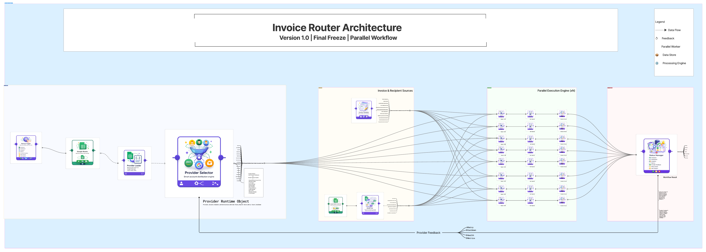

# InvoiceRouter Architecture

## v1.5.0 release boundary

The package release identity is `v1.5.0`. The architectural freeze remains Version 1.0 with exactly eight custom nodes. v1.5.0 does not add custom node types or replace the data-flow architecture; it hardens the frozen flow for bulk invoice sending, guarded real API activation, retry/writeback evidence, preset self-checks, and packaged node branding.

Operationally, v1.5.0 is build/install/live-test ready. Production approval requires the documented self-hosted n8n dry-run, provider sandbox API send, retry/writeback validation, and live canary runbook evidence.

The Version 1.0 responsibilities are frozen in [`VERSION_1_0_FREEZE.md`](VERSION_1_0_FREEZE.md) and [`docs/freeze/v1.0/`](docs/freeze/v1.0/).

## Runtime layers

1. **Source:** built-in Manual Trigger and Google Sheets nodes.
2. **Normalization:** Provider Loader and Email List.
3. **Selection:** Provider Selector and its runtime account pool.
4. **Invoice data:** Invoice Template.
5. **Merge:** Request Builder combines account, template, and recipient through three inputs, then attaches `sendGuard` approval metadata and a structured idempotency key.
6. **Execution:** Invoice Sender injects the runtime secret, enforces send guard/live-mode/duplicate-prevention checks, and executes one request only when those gates allow it.
7. **Analysis:** Status Checker converts the raw response to a standard status.
8. **Management:** Status Manager creates decisions/events, writes provider feedback, and emits normalized execution-log/status-writeback payloads.
9. **Writeback wiring:** Built-in Code and Google Sheets nodes flatten and upsert `management.statusWriteback` into the configured `invoice_results` Sheet.

## Feedback model

The workflow does not contain a physical cyclic connection. Status Manager updates the InvoiceRouter runtime pool and best-effort workflow static feedback. A later Provider Selector execution reads that state. This prevents an uncontrolled execution loop.

## State boundary

- Secret material is process-local and referenced by `credentialRef`.
- Provider health/locks/cooldowns are process-local for the active runtime.
- Status Manager stores a bounded feedback history in workflow static data when the n8n runtime exposes it.
- Status Manager can optionally persist a capped `invoiceRouterExecutionLog` static-data array, but external Sheet/DB writeback should be done by explicit downstream n8n nodes.
- Invoice Sender stores a bounded `invoiceRouterIdempotency` history in workflow static data when available, and also keeps in-process live-send reservations for active duplicate prevention.
- Multi-process shared pools and cross-worker idempotency beyond workflow static data require a future external-state freeze.

## Importable workflow

`workflows/InvoiceRouter-v1-production.json` is the canonical Version 1 workflow template. It is an inactive, Dry Run-first template with placeholder Google Sheet and credential IDs. The template is production-shaped, but it is not production-configured until the private provider Sheet, email Sheet, Provider Selector filters or conditional routing rules, provider-specific values, sendGuard review, and sandbox verification are completed.

The reference workbook under `examples/google_sheets/` is a demo/preset contract artifact. It must be copied to a private Google Sheet before real use; demo rows or example conditional notes must not be treated as runtime approval conditions. Runtime conditional routing lives in Provider Selector settings. Guarded send approval lives in Request Builder `sendGuard` metadata and Invoice Sender guard enforcement. Duplicate-send prevention lives in Request Builder idempotency metadata plus Invoice Sender runtime/static-data reservations.

## Provider-specific validation boundary

Provider Loader validates provider Sheet transport/account rows and auth-material completeness. Request Builder validates the selected provider, invoice template, recipient, and provider-specific custom fields together, then records errors in `readyRequest.providerValidation`. Send Guard treats any provider-validation error as a block-before-send condition.

## Idempotency boundary

Request Builder owns idempotency-key construction because it can inspect the selected provider profile, invoice, and recipient together. Invoice Sender owns duplicate-send enforcement because it is the last gate before provider HTTP transport. A `DUPLICATE` result is treated as a guarded non-transport outcome by Status Checker and Status Manager.

The bundled workflow uses workflow-scoped `Provider + Invoice + Recipient` keys. This requires stable invoice IDs in real input data; generated invoice IDs are useful for testing but should not be the only production duplicate-prevention identity.

## Execution logging and writeback boundary

Status Manager is the final normalization boundary for observability. It emits `management.executionLog` for audit/event sinks and `management.statusWriteback` for downstream UPSERT-style status updates. The bundled workflow now wires that payload to explicit built-in n8n nodes: `Prepare Status Writeback Row` and `Google Sheets - Status Writeback`.

This preserves the frozen eight-node custom package boundary: writeback is workflow configuration, not hidden node-side I/O. The Sheet branch must be configured with a private status Sheet ID, a Google Sheets credential, and an `invoice_results` tab whose first column is `writeback_key`.

## n8n dry-run validation boundary

The Step 07 validation package under `examples/n8n_dry_run_validation/` is a repository asset for the first real n8n import/run test. It validates editor import, custom-node availability, private Sheet reads, conditional routing, guarded blocking, idempotency metadata, execution-log payloads, and status-writeback payloads while Invoice Sender remains in Dry Run mode. It does not create provider invoices and does not replace provider sandbox testing.

The bundled workflow now defaults Provider Selector `environmentFilter` to `sandbox` to make the first imported workflow execution align with the dry-run validation package. Live routing requires an explicit human configuration change after sandbox approval.

## Step 08 request/response adapter boundary

The provider adapter boundary remains inside the frozen Request Builder -> Invoice Sender -> Status Checker path.

- `ProviderRegistry` builds the provider-specific body/query, fallback response paths, request-mapping metadata, and response-policy metadata.
- `Request Builder` attaches `readyRequest.requestMapping` and `readyRequest.responsePolicy` without executing HTTP.
- `Invoice Sender` validates the final interpolated live request for unresolved URL/header/query/body tokens before provider transport.
- `Invoice Sender` uses response-policy success status codes when setting transport success.
- `Status Checker` supports fallback response path arrays and carries policy retry hints into `standardStatus`.
- `Status Manager` uses retry-policy hints while preserving existing retry/cooldown behavior.

This step does not add another node, does not change the provider Sheet source-of-truth role, and does not perform external writeback.

## Step 10 retry/error classification boundary

Status Checker is the canonical classifier for provider-neutral retry/error metadata. It attaches `errorClassification`, `retryDecision`, `retryAfterSeconds`, and `retryDelayHintSeconds` to `standardStatus`. Status Manager consumes those fields to schedule retries only when the request is safe to retry, applies provider retry-after hints when enabled, caps the final delay, and carries the decision into execution logs, status writeback rows, alerts, and retry queue entries.

Validation, authentication, authorization, not-found, and unresolved conflict errors are treated as review-required failures rather than automatic retry candidates. Rate-limit, timeout, network, policy-marked retryable, and provider 5xx responses can be retried within the configured retry limit and delay cap.

## Step 11 sandbox/live activation boundary

Invoice Sender now owns an explicit activation-stage gate in addition to Dry Run, sendGuard, provider validation, idempotency, and duplicate prevention. The bundled workflow defaults to `dryRunValidation` with expected environment `sandbox`, blank sandbox confirmation, and blank live confirmation.

Promotion must be sequential: dry-run validation -> sandbox real send -> live real send. Sandbox real sends require `Sandbox Mode Confirmation = SEND_SANDBOX_INVOICES`; live real sends require `Live Mode Confirmation = SEND_REAL_INVOICES`. Activation metadata is carried from raw execution to standard status, execution logs, and status writeback rows for later forensic review.

## Step 11B/11C icon/card wiring boundary

Step 11B adds visual runtime metadata only. Each custom node description now points to a branded SVG icon using `file:invoice-router-*.svg`; the build copies those icons into `dist` beside the compiled node files. No node count, data flow, provider behavior, retry behavior, activation safety behavior, or workflow business logic changes were made.

Step 11C replaces the initial minimal icons with polished, hand-authored SVG interpretations of the existing Version 1.0 node-card visual language: rounded purple cards, side connector dots, bottom status pills, and node-specific invoice/provider/status symbols. The SVG icons intentionally contain no text initials or font-dependent glyphs.

The existing `assets/node-cards/v1.0/` PNGs remain documentation/design assets. n8n runtime node cards use the packaged SVG icons from the compiled node folders.

## Step 11D Bulk Run Safety

Bulk sending remains item-stream based: multiple Email List rows flow through the single Request Builder, Invoice Sender, Status Checker, and Status Manager lane. Invoice Sender now enforces run-level bulk gates before and during real HTTP sends:

- maximum invoices per execution
- uniform sandbox/live environment requirement
- optional delay between real sends
- failed-send abort threshold
- critical-error abort for credential, activation, guard, validation, authentication, and authorization problems
- additional sandbox/live bulk confirmation phrases for multi-item real sends

Status Manager now exposes `management.bulkSummary` and includes bulk safety metadata in execution log and status writeback output.

## Step 11E - Production Preset and Retry Loop

Invoice Sender now performs a production preset self-check before transport. The check prevents UI reset or accidental parameter edits from weakening dry-run, sandbox, or live activation safety. The production workflow also includes a guarded automatic retry branch from Status Manager through a built-in Code node and Wait node back into Invoice Sender. Retry attempts remain subject to send guard, activation safety, duplicate prevention, bulk safety, and provider retry classification.

## Step 12B - n8n Registry/UI Install Compatibility

Step 12B changes only release/discovery metadata and n8n editor searchability. The internal node type keys, eight-node topology, workflow business logic, provider mapping, activation safety, bulk safety, and retry behavior remain unchanged.

The published package is intended to be installed from npm through the n8n Community Nodes UI. To support that path, package metadata keeps the required n8n community-node keyword and compiled `n8n.nodes` manifest, removes the runtime `n8n-workflow` peer dependency risk, and ships a diagnostic script for fallback manual installs.

All custom node display names are prefixed with `InvoiceRouter` so users can find the node family from the n8n editor search. Existing workflow node instance names can remain short because n8n resolves custom node types by their package/type key, not by the visible display label.
